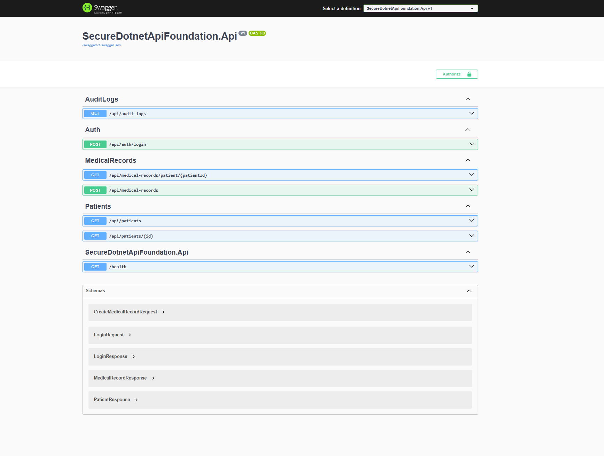

# Secure .NET API Foundation

## Overview

Secure .NET API Foundation is a healthcare-oriented ASP.NET Core API project focused on Application Security, Secure SDLC and Technical GRC concepts.

The project demonstrates secure API engineering practices including:

- JWT authentication
- Role-Based Access Control (RBAC)
- Audit logging
- API hardening
- Rate limiting
- Secure middleware
- OWASP-aligned controls

---

## Swagger UI

The API exposes secured healthcare-oriented endpoints protected with JWT authentication and RBAC authorization policies.

---

## Architecture

Main domains:

- Auth
- Patients
- MedicalRecords
- AuditLogs

### High-Level Flow

1. User authenticates through `/api/auth/login`
2. JWT token is generated
3. Protected endpoints require valid JWT authentication
4. RBAC policies enforce least privilege access
5. Sensitive actions are recorded through audit logging
6. Security middleware applies hardening controls and correlation tracing

---

## Security Controls

| Control | Purpose |
|---|---|
| JWT Authentication | Secure user authentication |
| RBAC Policies | Least privilege authorization |
| Rate Limiting | Abuse and brute force mitigation |
| Audit Logging | Accountability and traceability |
| Security Headers | HTTP hardening |
| Exception Middleware | Prevent information leakage |
| Correlation IDs | Request traceability |

---

## Authentication

The API uses JWT Bearer authentication with:

- issuer validation
- audience validation
- signing key validation
- expiration validation

Swagger integration allows authenticated testing directly from the UI.

---

## Authorization

Policy-based authorization is used to protect sensitive endpoints.

### Example Policies

- CanViewMedicalRecords
- CanManageMedicalRecords
- Auditor/Admin access restrictions

### Example Roles

- Doctor
- Nurse
- Auditor
- Admin

---

## Threat Model

Main threats considered during development:

- Broken Access Control
- Unauthorized medical record access
- Brute force authentication attacks
- JWT abuse
- Excessive API usage
- Information disclosure
- Missing audit traceability

### Security Mitigations Implemented

| Threat | Mitigation |
|---|---|
| Broken Access Control | RBAC authorization policies |
| Unauthorized medical record access | Role-based endpoint protection |
| Brute force authentication attacks | ASP.NET Core Rate Limiting |
| JWT abuse | JWT validation and expiration |
| Excessive API usage | Fixed-window rate limiting |
| Information disclosure | DTO-based response models |
| Missing audit traceability | Centralized audit logging |
| Unhandled exceptions | Global exception middleware |
| Request correlation issues | Correlation ID middleware |

### Security Design Principles

- Least privilege access
- Defense in depth
- Secure-by-default APIs
- Traceability and accountability
- Reduced attack surface

---

## OWASP API Security Top 10 Mapping

| OWASP API Risk | Project Mitigation |
|---|---|
| API1: Broken Object Level Authorization | RBAC authorization policies and protected patient/medical record endpoints |
| API2: Broken Authentication | JWT Bearer authentication with issuer, audience, signing key and lifetime validation |
| API3: Broken Object Property Level Authorization | DTO-based request and response models to reduce unnecessary data exposure |
| API4: Unrestricted Resource Consumption | Rate limiting policies for authentication and API endpoints |
| API5: Broken Function Level Authorization | Policy-based authorization for patients, medical records and audit logs |
| API8: Security Misconfiguration | Security headers, HTTPS redirection and centralized exception handling |
| API9: Improper Inventory Management | Swagger/OpenAPI documentation and structured API routes |
| API10: Unsafe Consumption of APIs | Controlled backend-only data access through EF Core and internal services |

---

## Security Testing

Tested scenarios include:

- Access without JWT token
- Access with invalid roles
- Expired JWT tokens
- Brute force login attempts
- Unauthorized medical record access attempts
- Invalid payload validation
- Rate limiting behavior
- Authentication failure logging
- Authorization enforcement testing

---

## Middleware Security Features

Custom middleware protections include:

- Correlation ID tracking
- Centralized exception handling
- Secure response headers
- Request traceability support

### Security Headers

- X-Content-Type-Options
- X-Frame-Options
- Referrer-Policy
- Permissions-Policy

---

## Audit Logging

Security-relevant actions are logged for traceability and monitoring purposes.

### Logged Events

- Successful login attempts
- Failed login attempts
- Medical record access
- Medical record creation
- Audit log access

### Logged Metadata

- Username
- Role
- Timestamp
- Correlation ID
- IP address
- Action performed

---

## Technologies

- ASP.NET Core
- Entity Framework Core
- JWT Bearer Authentication
- Swagger / OpenAPI
- BCrypt
- GitHub Actions
- xUnit
- Docker

---

## CI/CD and DevSecOps

The repository integrates GitHub Actions CI workflows for automated validation and pipeline testing.

Current pipeline capabilities include:

- Automated build validation
- CI workflow execution
- Security-oriented repository structure

Planned improvements:

- CodeQL integration
- Dependency vulnerability scanning
- Secrets scanning
- Automated security testing

---

## Future Improvements

Planned security enhancements include:

- FluentValidation integration
- Refresh token support
- Integration security testing
- CodeQL security scanning
- Dependency vulnerability scanning
- Secrets scanning
- API versioning
- Structured SIEM-friendly logging
- Centralized logging integration
- Container security hardening

---

## Project Goals

This repository was designed to demonstrate:

- Application Security engineering mindset
- Secure SDLC practices
- Secure API architecture
- Technical GRC awareness
- Defensive security controls
- AppSec-oriented development workflows

---

## Security Disclaimer

This project is intended for educational and portfolio purposes only.